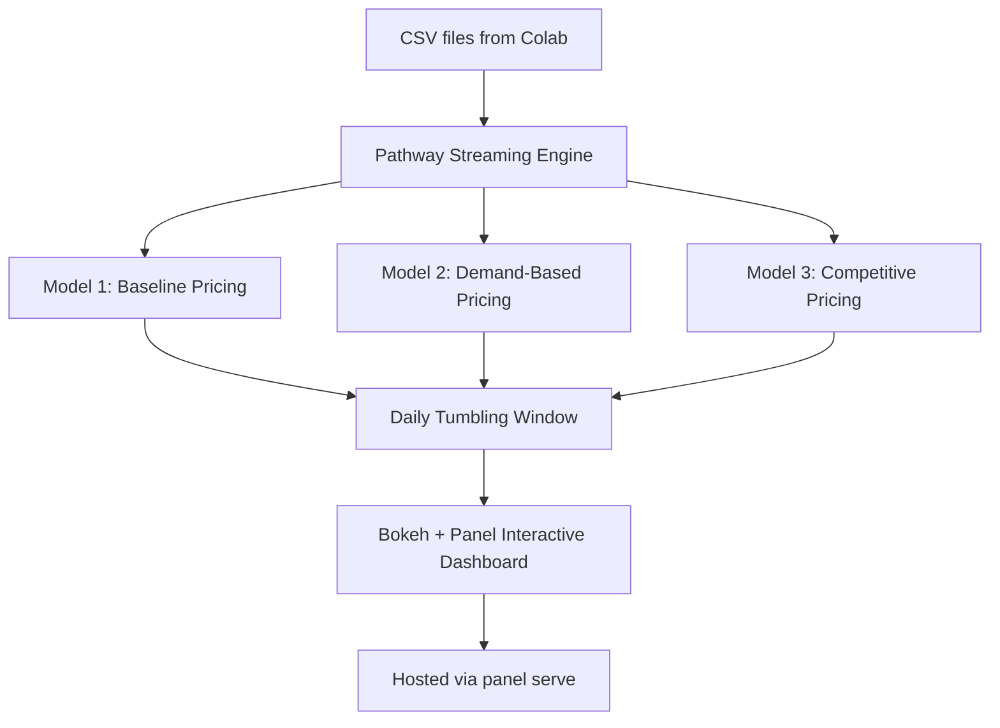

# 🚗 Real-Time Dynamic Parking Pricing Dashboard

[](https://colab.research.google.com/drive/1EJVB5KEEsG_vzsu49-3Oofi5fG1qThDV?usp=sharing)

> 📍 **Google Colab Notebook**: [Click here to open in Colab](https://colab.research.google.com/drive/1EJVB5KEEsG_vzsu49-3Oofi5fG1qThDV?usp=sharing)

---

This project implements a real-time dynamic pricing system for 14 different parking lots using real-time streaming, temporal windowing, and interactive plotting. It is powered by **Pathway** for streaming data processing and **Panel + Bokeh** for live visualizations.

---

## 🧰 Tech Stack Used

| Tool/Library | Purpose |
|--------------|---------|
| Pathway      | Real-time stream processing |
| Panel        | Interactive app & layout framework |
| Bokeh        | Interactive plotting engine |
| Pandas       | Preprocessing & CSV manipulation |
| Google Colab | Notebook-based dev environment |
| Render / HF Spaces | Optional deployment targets |

---

## 🧠 Architecture Diagram



---

## ⚙️ Project Workflow

1. **Data Preprocessing**: Combine date + time, sort timestamps, and export 14 unique datasets by `SystemCodeNumber`.
2. **Streaming**: Use `pw.demo.replay_csv` to create 14 parallel live data streams.
3. **Models**:
   - **Model 1**: Baseline pricing using occupancy range.
   - **Model 2**: Demand score from weighted feature factors.
   - **Model 3**: Adds location + competition awareness.
4. **Visualization**: Each stream rendered using Bokeh and displayed in Panel tabs or columns.
5. **Deployment**: Serve locally or via cloud using `panel serve`.

---

## ⚙️ Models Explained

### ✅ Model 1: Baseline Linear Pricing
**Formula**: `price = 10 + (occ_max - occ_min) / cap`  
- Uses Pathway’s tumbling window (1 day) to group data
- Computes max/min occupancy and divides difference by capacity
- Each parking lot (SystemCodeNumber) is grouped separately
- Plots one curve per lot in a shared Bokeh figure

### ✅ Model 2: Demand-Based Pricing
**Formula**: 
```text
demand = α(occupancy/capacity) + β(queue) + γ(traffic) + δ(special_day) + ε(vehicle_weight)
price = base * (1 + λ * normalized_demand)
```
- All categorical features (traffic level, vehicle type) are encoded manually
- Weights (α, β, γ, δ, ε) are hand-tuned
- Normalization helps control demand scores
- Prices are clipped to a range [5, 20]

### ✅ Model 3: Competitive Pricing Model
- Extends Model 2 with location awareness and competition effects
- Calculates:
  - `competition_factor = 1 - (num lots nearby / 10)`
  - `location_premium = +10% if GPS is within a hot zone`
- Final price is calculated as:
```text
price = base * (1 + λ * demand + 0.2 * location - 0.2 * (1 - competition))
```
- Pricing range constrained to [5, 25]

---

## 📈 Plotting Structure

Each model generates:
- A `Bokeh` line chart with `SystemCodeNumber`-wise grouping
- 14 plots under each model showing **14 lines (one per parking lot)** using color mapping
- Red scatter points on top of line chart to show individual updates
- `Panel` is used to group these plots and serve them

---


## 👤 Author

**Arnab Deka**  
ECE, IIT Guwahati'28
[GitHub](https://github.com/gh-arnab21) · [Colab](https://colab.research.google.com/drive/1EJVB5KEEsG_vzsu49-3Oofi5fG1qThDV?usp=sharing)

---

## 🧾 License

This project is licensed under the MIT License.
