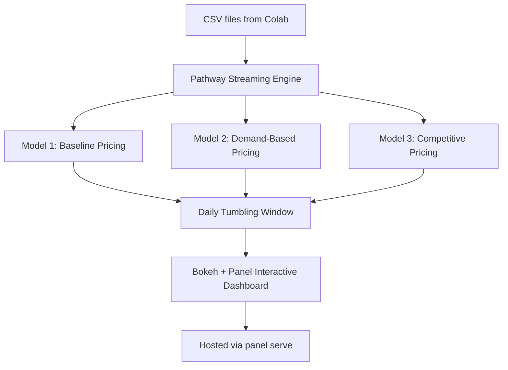

# 🚗 Real-Time Dynamic Parking Pricing Dashboard

> 📍 **Google Colab Notebook**: [Click here to open in Colab](https://colab.research.google.com/drive/1EJVB5KEEsG_vzsu49-3Oofi5fG1qThDV?usp=sharing)

---

This project implements a real-time dynamic pricing system for 14 different parking lots using real-time streaming, temporal windowing, and interactive plotting. It is powered by **Pathway** for streaming data processing and **Panel + Bokeh** for live visualizations.

---

## 🧰 Tech Stack Used

| Tool/Library | Purpose |
|--------------|---------|
| Pathway      | Real-time stream processing |
| Panel        | Interactive app & layout framework |
| Bokeh        | Interactive plotting engine |
| Pandas       | Preprocessing & CSV manipulation |
| Google Colab | Notebook-based dev environment |
| Render / HF Spaces | Optional deployment targets |

---

## 🧠 Architecture Diagram

---

## ⚙️ Project Workflow

1. **Data Preprocessing**: Combine date + time, sort timestamps, and export 14 unique datasets by `SystemCodeNumber`.
2. **Streaming**: Use `pw.demo.replay_csv` to create 14 parallel live data streams.
3. **Models**:
   - **Model 1**: Baseline pricing using occupancy range.
   - **Model 2**: Demand score from weighted feature factors.
   - **Model 3**: Adds location + competition awareness.
4. **Visualization**: Each stream rendered using Bokeh and displayed in Panel tabs or columns.
5. **Deployment**: Serve locally or via cloud using `panel serve`.

---

## 👤 Author

**Arnab Deka**  
ECE, IIT Guwahati'28
[GitHub](https://github.com/yourusername) · [Colab](https://colab.research.google.com/drive/1EJVB5KEEsG_vzsu49-3Oofi5fG1qThDV?usp=sharing)

---

## 🧾 License

This project is licensed under the MIT License.
